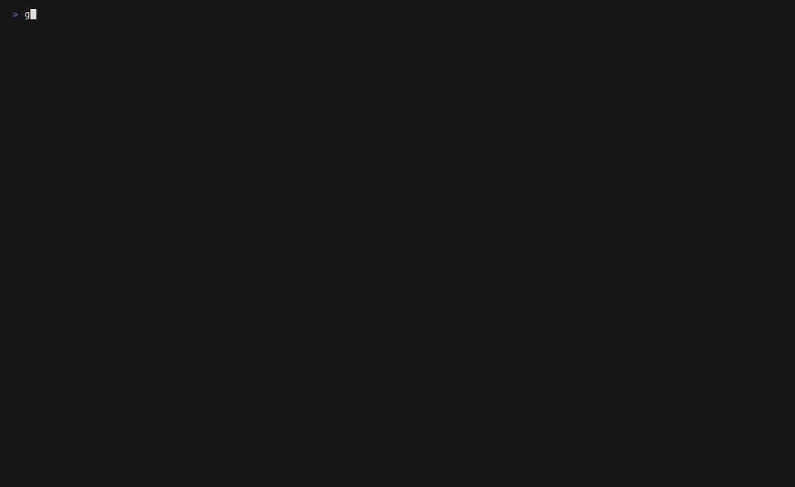

<h1 align="center">kube-shield</h1>
<p align="center"><strong>Kubernetes Security Posture Manager - k9s for security</strong></p>

<p align="center">
  <a href="https://github.com/RamazanKara/kube-shield/actions/workflows/ci.yml"></a>
  <a href="https://github.com/RamazanKara/kube-shield/actions/workflows/e2e.yml"></a>
  <a href="https://goreportcard.com/report/github.com/RamazanKara/kube-shield"></a>
  <a href="https://github.com/RamazanKara/kube-shield/releases"></a>
  <a href="LICENSE"></a>
  <a href="https://codecov.io/gh/RamazanKara/kube-shield"></a>
</p>

---

`kube-shield` is a Kubernetes security posture scanner for quick local reviews, CI gates, and scheduled cluster checks. It reads Kubernetes API objects, highlights risky workload, CIS Kubernetes Benchmark v1.12, RBAC, network policy, and secret patterns, then turns them into actionable findings.



Use it when you want a lightweight security pass that is easy to run, easy to read, and still friendly to automation.

## Why kube-shield

- Finds common Kubernetes posture issues without installing a controller first.
- Groups checks into workload, CIS, RBAC, network policy, and secrets scanners.
- Shows results as a readable table, JSON for pipelines, SARIF for GitHub Code Scanning, or an interactive TUI.
- Supports severity thresholds and `--exit-code` so CI can fail only on the risks you care about.
- Includes structured remediation and optional AI explanations through OpenAI or local Ollama.
- Ships signed release archives, SBOMs, attestations, GHCR images, an OCI Helm chart, and a Homebrew cask.

## Scope

kube-shield checks Kubernetes API-visible configuration. It does not replace runtime threat detection, admission control, node hardening, cloud IAM review, or a full CIS audit of control-plane host files. It is meant to make the most common cluster posture problems visible fast.

## Install

Pick the install path that matches how you want to run scans.

### Homebrew

```bash
brew install --cask ramazankara/tap/kube-shield
```

### Go

```bash
go install github.com/RamazanKara/kube-shield@latest
```

### Docker

```bash
docker run --rm \
  -v ~/.kube:/home/kubeshield/.kube:ro \
  ghcr.io/ramazankara/kube-shield:v1.0.1 scan
```

### Binary Archives

Download Linux, macOS, and Windows archives from the [GitHub releases page](https://github.com/RamazanKara/kube-shield/releases). Each release includes checksums, SBOMs, and Sigstore signature bundles.

## Quick Start

Run a first scan against your current Kubernetes context:

```bash
kube-shield scan
```

Common next steps:

```bash
# Scan one namespace
kube-shield scan --namespace production

# Run selected scanners
kube-shield scan --scanners rbac,netpol

# Show only high and critical findings
kube-shield scan --severity high

# Emit SARIF for GitHub Code Scanning
kube-shield scan --output sarif > results.sarif

# Fail CI when critical findings exist
kube-shield scan --exit-code --severity critical
```

Launch the dashboard:

```bash
kube-shield dashboard
kube-shield dashboard --namespace production
```

Use AI explanations:

```bash
kube-shield scan --ai-provider openai --ai-api-key "$OPENAI_API_KEY"
kube-shield scan --ai-provider ollama --ai-endpoint http://localhost:11434
```

In the TUI, press `e` on a finding detail view to request an AI explanation.

## CLI Reference

### Global Flags

| Flag | Short | Default | Description |
|------|-------|---------|-------------|
| `--config` | | `$HOME/.kube-shield.yaml` | Config file path |
| `--kubeconfig` | | `$KUBECONFIG` or `~/.kube/config` | Kubeconfig path |
| `--context` | | current context | Kubernetes context |
| `--namespace` | `-n` | all namespaces | Namespace filter |
| `--output` | `-o` | `table` | `table`, `json`, or `sarif` |
| `--verbose` | `-v` | `false` | Verbose logs |
| `--ai-provider` | | disabled | `openai` or `ollama` |
| `--ai-model` | | provider default | Model name |
| `--ai-api-key` | | empty | AI provider API key |
| `--ai-endpoint` | | provider default | Custom AI endpoint |

### `kube-shield scan`

| Flag | Default | Description |
|------|---------|-------------|
| `--scanners` | all scanners | Comma-separated scanner list: `workload,cis,rbac,netpol,secrets` |
| `--severity` | `low` | Minimum severity: `critical`, `high`, `medium`, `low`, `info` |
| `--category` | all categories | Finding category filter |
| `--timeout` | `5m` | Scan timeout |
| `--exit-code` | `false` | Exit non-zero when matching findings are present |

### `kube-shield dashboard`

| Flag | Default | Description |
|------|---------|-------------|
| `--scanners` | all scanners | Comma-separated scanners to run |

### `kube-shield version`

Print build version, commit, and build date.

## Configuration

Configuration precedence is:

```text
CLI flags > environment variables > config file > defaults
```

Place `.kube-shield.yaml` in the project directory or home directory:

```yaml
context: ""
namespace: ""
output: table

scanners:
  - workload
  - cis
  - rbac
  - netpol
  - secrets

severity: low
timeout: 5m
exit-code: false

ai:
  provider: ""   # openai, ollama, or empty
  model: ""
  apikey: ""     # prefer KUBE_SHIELD_AI_APIKEY
  endpoint: ""
```

Environment variables use the `KUBE_SHIELD_` prefix:

| Variable | Config Key | Example |
|----------|------------|---------|
| `KUBE_SHIELD_CONTEXT` | `context` | `staging-cluster` |
| `KUBE_SHIELD_NAMESPACE` | `namespace` | `production` |
| `KUBE_SHIELD_OUTPUT` | `output` | `json` |
| `KUBE_SHIELD_SCANNERS` | `scanners` | `rbac,secrets` |
| `KUBE_SHIELD_SEVERITY` | `severity` | `high` |
| `KUBE_SHIELD_TIMEOUT` | `timeout` | `10m` |
| `KUBE_SHIELD_EXIT_CODE` | `exit-code` | `true` |
| `KUBE_SHIELD_AI_PROVIDER` | `ai.provider` | `openai` |
| `KUBE_SHIELD_AI_APIKEY` | `ai.apikey` | `sk-...` |
| `KUBE_SHIELD_AI_MODEL` | `ai.model` | `gpt-4o-mini` |
| `KUBE_SHIELD_AI_ENDPOINT` | `ai.endpoint` | `http://localhost:11434` |

## Scanners

| Scanner | Checks | Severity Range | Focus |
|---------|--------|----------------|-------|
| `workload` | 17 | Critical to Info | Pod and container security posture |
| `cis` | 14 | Critical to Low | CIS Kubernetes Benchmark v1.12 API-accessible checks |
| `rbac` | 12 | Critical to Medium | Over-permissive roles and risky bindings |
| `netpol` | 6 | High to Medium | Missing isolation and permissive policies |
| `secrets` | 6 | High to Info | Secret exposure and reference hygiene |

See [docs/SCANNERS.md](docs/SCANNERS.md) for every check ID, severity, and remediation category.

## Helm

Install from the published OCI chart:

```bash
helm install kube-shield oci://ghcr.io/ramazankara/charts/kube-shield \
  --version 1.0.1 \
  --namespace kube-shield \
  --create-namespace
```

Run the local chart during development:

```bash
helm install kube-shield deploy/helm \
  --namespace kube-shield \
  --create-namespace \
  --set severity=medium
```

Common values:

| Value | Default | Description |
|-------|---------|-------------|
| `schedule` | `0 */6 * * *` | CronJob schedule |
| `scanners` | all 5 scanners | Scanner list |
| `severity` | `low` | Minimum severity |
| `output` | `json` | Report output format |
| `image.repository` | `ghcr.io/ramazankara/kube-shield` | Container repository |
| `image.tag` | chart appVersion | Container tag |
| `serviceAccount.create` | `true` | Create ServiceAccount |

See [deploy/helm/values.yaml](deploy/helm/values.yaml) for all chart values.

## Release Verification

Install `gh` with attestation support and `cosign` before running verification commands.

```bash
gh release download v1.0.1 --repo RamazanKara/kube-shield \
  --pattern checksums.txt \
  --pattern checksums.txt.sigstore.json \
  --pattern kube-shield_1.0.1_linux_amd64.tar.gz

gh attestation verify kube-shield_1.0.1_linux_amd64.tar.gz \
  --repo RamazanKara/kube-shield

cosign verify-blob --bundle checksums.txt.sigstore.json \
  --certificate-identity-regexp 'https://github.com/RamazanKara/kube-shield/.github/workflows/release.yml@refs/tags/v.*' \
  --certificate-oidc-issuer https://token.actions.githubusercontent.com \
  checksums.txt

cosign verify ghcr.io/ramazankara/kube-shield:v1.0.1 \
  --certificate-identity-regexp 'https://github.com/RamazanKara/kube-shield/.github/workflows/release.yml@refs/tags/v.*' \
  --certificate-oidc-issuer https://token.actions.githubusercontent.com
```

Install-channel smoke checks:

```bash
docker pull ghcr.io/ramazankara/kube-shield:v1.0.1
helm show chart oci://ghcr.io/ramazankara/charts/kube-shield --version 1.0.1
brew install --cask ramazankara/tap/kube-shield
```

## TUI Keybindings

| Key | Action |
|-----|--------|
| `Tab` / `Shift+Tab` | Switch panels |
| `Up` / `k` | Move up |
| `Down` / `j` | Move down |
| `Enter` | Open finding details |
| `Esc` | Back |
| `/` | Filter findings |
| `e` | AI explanation in detail view |
| `r` | Refresh scan |
| `?` | Toggle help |
| `q` / `Ctrl+C` | Quit |

## Documentation

- [Scanner reference](docs/SCANNERS.md)
- [Architecture](docs/ARCHITECTURE.md)
- [Development guide](docs/DEVELOPMENT.md)
- [Release process](RELEASE.md)
- [Repository operations checklist](docs/REPOSITORY_SETUP.md)
- [Security policy](SECURITY.md)
- [Support](SUPPORT.md)
- [Contributing](CONTRIBUTING.md)

## Contributing

Contributions are welcome. Start with [CONTRIBUTING.md](CONTRIBUTING.md):

```bash
git clone https://github.com/RamazanKara/kube-shield.git
cd kube-shield
make build
make test
make lint
```

## License

Apache License 2.0. See [LICENSE](LICENSE).
