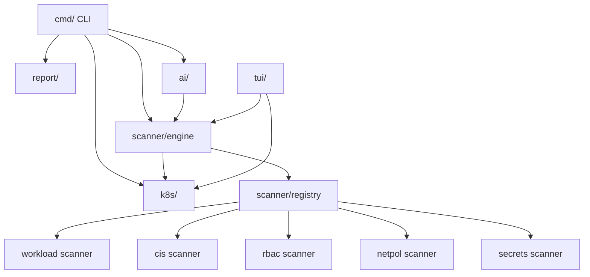

# Architecture

This document describes the high-level architecture of kube-shield.

## Package Layout

```
kube-shield/
├── cmd/                          # CLI commands (cobra)
│   ├── root.go                   # Root command, global flags
│   ├── scan.go                   # `scan` subcommand
│   ├── dashboard.go              # `dashboard` TUI subcommand
│   └── version.go                # `version` subcommand
├── pkg/
│   ├── ai/                       # AI remediation providers
│   │   ├── provider.go           # Provider interface + OpenAI/Ollama
│   │   └── analyzer.go           # AnalyzeFindings helper
│   ├── config/                   # Config loading (viper)
│   ├── graph/                    # Attack-path graph generation
│   ├── k8s/                      # Kubernetes client wrapper
│   ├── logging/                  # Structured logging (slog)
│   ├── report/                   # Output formatters (table, JSON, SARIF)
│   ├── scanner/
│   │   ├── registry.go           # DefaultRegistry (registers all scanners)
│   │   ├── engine/               # Engine, Registry, types (Finding, Report)
│   │   ├── workload/             # Workload security scanner
│   │   ├── cis/                  # CIS Kubernetes Benchmark scanner
│   │   ├── rbac/                 # RBAC over-privilege scanner
│   │   ├── netpol/               # Network policy scanner
│   │   └── secrets/              # Secrets exposure scanner
│   ├── tui/                      # Bubbletea terminal UI
│   └── version/                  # Build metadata
├── test/
│   └── e2e/                      # End-to-end tests (kind cluster)
│       ├── main_test.go          # TestMain: cluster lifecycle
│       ├── testdata/fixtures/    # Vulnerable K8s manifests
│       └── *_test.go             # Per-scanner + CLI E2E tests
└── .github/workflows/
    ├── ci.yml                    # Unit tests, lint, build
    └── e2e.yml                   # E2E tests on kind
```

## Component Diagram



## Data Flow

1. User invokes `kube-shield scan` (or `dashboard`).
2. `cmd/scan.go` creates a Kubernetes client via `pkg/k8s`.
3. `pkg/scanner.DefaultRegistry()` provides a pre-configured `engine.Registry` with all 5 scanners.
4. `engine.Engine` runs scanners concurrently (bounded by semaphore).
5. Each scanner queries the Kubernetes API and returns `[]engine.Finding`.
6. The engine builds an `engine.Report` (findings + summary + score).
7. Findings are filtered by severity/category.
8. Output is rendered via `pkg/report` (table, JSON, or SARIF).
9. Optionally, `pkg/ai.AnalyzeFindings` explains high-severity issues.

## Scanner Interface

Every scanner implements:

```go
type Scanner interface {
    Name() string
    Category() Category
    Description() string
    Scan(ctx context.Context, client kubernetes.Interface, namespace string) (*ScanResult, error)
}
```

Scanners are stateless and safe for concurrent use. They receive a `kubernetes.Interface` (real or fake) and return structured findings.

## Concurrency Model

The engine uses a bounded worker pool (`concurrency` parameter, default 5). Each scanner runs in its own goroutine. Context cancellation and timeouts propagate to all scanners.

## Error Handling

Sentinel errors in `pkg/scanner/engine/errors.go`:

| Error                | Meaning                         |
|---------------------|---------------------------------|
| `ErrScanTimeout`    | Scanner exceeded timeout        |
| `ErrPartialResults` | Some scanners failed            |
| `ErrNoClusterAccess`| Cannot connect to cluster       |
| `ErrNoScanners`     | No scanners registered          |

## Build & Versioning

Version info is injected via ldflags at build time into `pkg/version`:

```makefile
-ldflags "-X github.com/RamazanKara/kube-shield/pkg/version.Version=$(VERSION) \
          -X github.com/RamazanKara/kube-shield/pkg/version.Commit=$(COMMIT) \
          -X github.com/RamazanKara/kube-shield/pkg/version.Date=$(DATE)"
```
