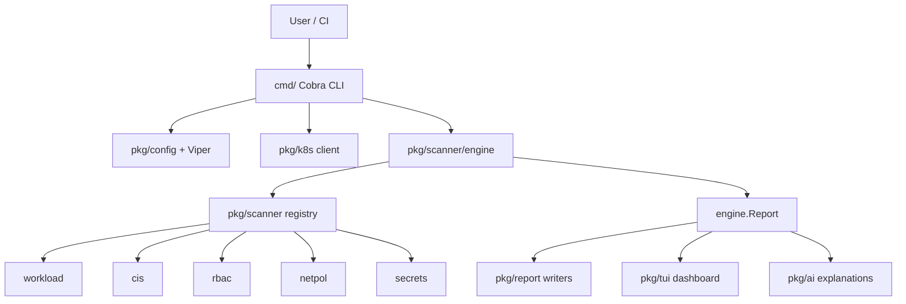
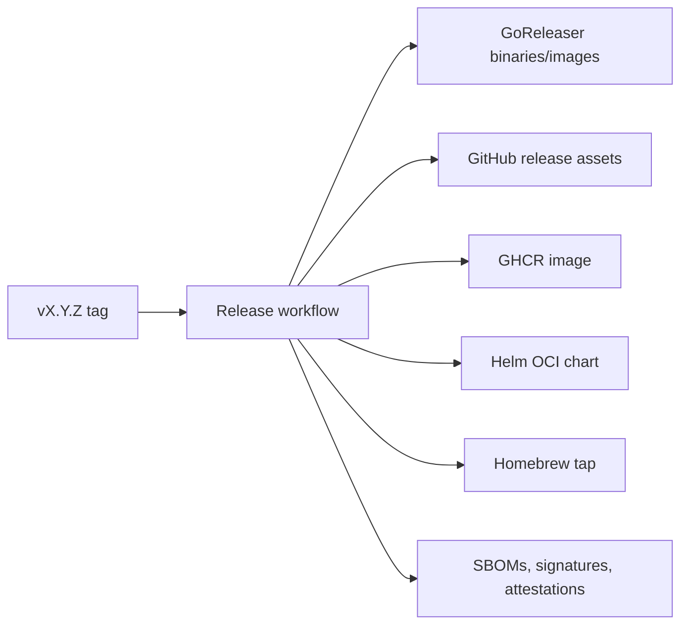

# Architecture

kube-shield is a Go CLI built around a small scanner engine, Kubernetes API clients, report writers, and an optional Bubble Tea terminal UI.

This document is for contributors who want to understand where a change belongs before editing code.

## Design Goals

- Keep scanning deterministic and testable with Kubernetes fake clients.
- Validate CLI/config input before opening a Kubernetes connection.
- Keep scanner findings stable enough for CI, SARIF, docs, and downstream automation.
- Prefer small package boundaries over framework-heavy abstractions.
- Make release artifacts reproducible and verifiable.

## Package Layout

```text
kube-shield/
├── cmd/                          # Cobra commands and CLI validation
│   ├── root.go                   # Root command, global flags, Viper setup
│   ├── scan.go                   # scan command
│   ├── dashboard.go              # dashboard command
│   └── version.go                # version command
├── pkg/
│   ├── ai/                       # OpenAI and Ollama providers
│   ├── config/                   # Config loading and normalization
│   ├── k8s/                      # Kubernetes client construction
│   ├── logging/                  # slog wrapper
│   ├── report/                   # Table, JSON, and SARIF writers
│   ├── scanner/
│   │   ├── registry.go           # Default scanner registry
│   │   ├── engine/               # Scanner interface, engine, report types
│   │   ├── workload/             # Pod/container security checks
│   │   ├── cis/                  # CIS Kubernetes Benchmark v1.12 checks
│   │   ├── rbac/                 # RBAC checks
│   │   ├── netpol/               # NetworkPolicy checks
│   │   └── secrets/              # Secret exposure/reference checks
│   ├── tui/                      # Interactive dashboard
│   └── version/                  # Build metadata injected by ldflags
├── deploy/helm/                  # CronJob Helm chart
├── test/e2e/                     # kind-based E2E suite
└── .github/workflows/            # CI, E2E, dry-run, release workflows
```

## Component Flow



## Scan Flow

1. Cobra parses CLI flags.
2. Viper loads environment variables and config files.
3. Command-specific flag overrides are applied so precedence is CLI flags > env vars > config file > defaults.
4. CLI values are validated before connecting to Kubernetes.
5. `pkg/k8s.NewClient` builds a client from in-cluster config, `KUBECONFIG`, or `~/.kube/config`.
6. `scanner.DefaultRegistry()` registers the five built-in scanners.
7. `engine.Engine` runs selected scanners concurrently with a bounded semaphore.
8. The engine builds an `engine.Report` and returns partial-result errors if any scanner fails.
9. The command filters findings by severity/category and recomputes the summary.
10. `pkg/report` writes table, JSON, or SARIF output.
11. Optional AI analysis explains high-severity findings after report output.

## Scanner Contract

```go
type Scanner interface {
    Name() string
    Category() Category
    Description() string
    Scan(ctx context.Context, client kubernetes.Interface, namespace string) (*ScanResult, error)
}
```

Scanners receive a `kubernetes.Interface` so unit tests can use fake clients. Scanner implementations should be stateless because the engine runs them concurrently.

Scanners should return findings, not write output. Filtering, summaries, table/JSON/SARIF formatting, and exit-code behavior belong outside scanner packages.

## Finding Model

Each finding contains:

- Stable `ID` and `CheckID`.
- Human-readable title and description.
- Severity and category.
- Kubernetes resource identity.
- Remediation guidance.
- Optional CIS reference and external references.

The report summary includes total count, counts by severity/category, a score from 0 to 100, and a letter grade.
Known equivalent CIS/core findings are de-duplicated for summary counts and scoring; raw findings remain in the report for compliance traceability.

## Error Handling

Sentinel errors live in `pkg/scanner/engine/errors.go`:

| Error | Meaning |
|-------|---------|
| `ErrScanTimeout` | Scan exceeded its deadline |
| `ErrPartialResults` | One or more scanners failed while others returned results |
| `ErrNoClusterAccess` | Cluster access failed |
| `ErrNoScanners` | Registry has no scanners |

Command validation errors are returned before Kubernetes connection attempts.

## Output Writers

- Table output is optimized for humans.
- JSON output serializes `engine.Report`.
- SARIF output is for GitHub Code Scanning and uses build-time version metadata.

Writers should not re-scan, mutate Kubernetes objects, or change finding severity. They format the report they are given.

## Release Architecture

The release path is tag-triggered:



The local `Dockerfile` remains a multi-stage developer build. `Dockerfile.release` is used by GoReleaser and copies already-built binaries into image layers.

## Build Metadata

Build-time metadata is injected with ldflags:

```shell
-X github.com/RamazanKara/kube-shield/pkg/version.Version=${VERSION}
-X github.com/RamazanKara/kube-shield/pkg/version.Commit=${COMMIT}
-X github.com/RamazanKara/kube-shield/pkg/version.Date=${DATE}
```

The same metadata is used by `kube-shield version`, SARIF output, release archives, and container images.
